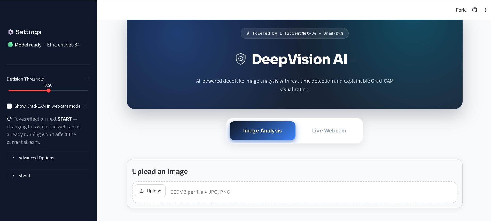
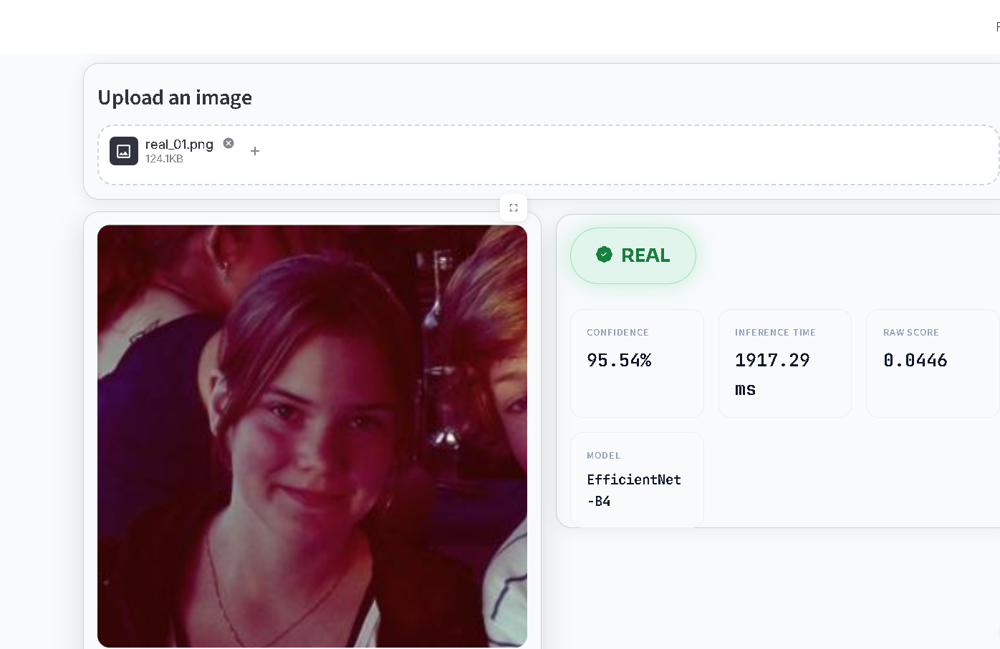
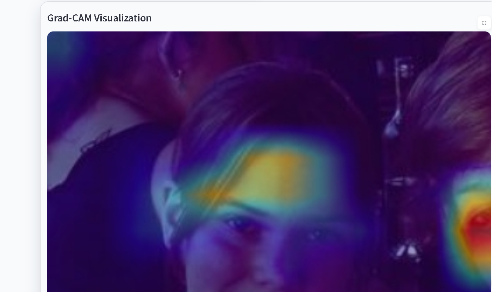
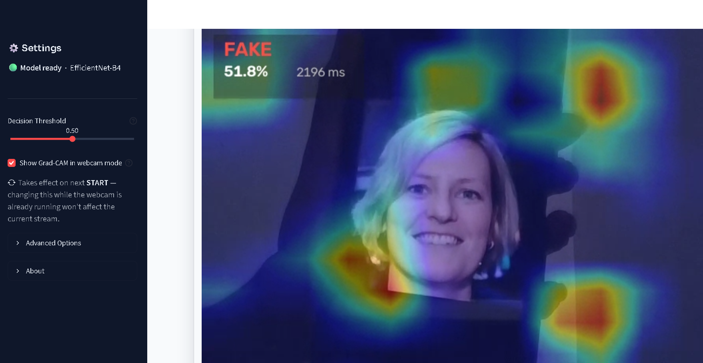

# DeepVision AI – Deepfake Image Detection

DeepVision AI is a deepfake image detection application built using **TensorFlow**, **EfficientNet-B4**, and **Streamlit**. The application analyzes uploaded images as well as live webcam frames to classify them as **Real** or **Fake**, while also providing **Grad-CAM visualizations** to explain which regions influenced the model's prediction.

The project combines deep learning with explainable AI to make model predictions more transparent and easier to interpret.

---

## Features

- Deepfake detection for uploaded images
- Real-time webcam-based detection
- Explainable AI using Grad-CAM heatmaps
- Adjustable decision threshold
- Confidence score and inference time display
- Modern Streamlit interface with custom CSS
- EfficientNet-B4 based classification model
- Optimized inference pipeline for smoother webcam performance

---

## Tech Stack

| Category | Technologies |
| :--- | :--- |
| Programming Language | Python |
| Deep Learning Framework | TensorFlow, Keras |
| Computer Vision | OpenCV |
| Data Handling | NumPy |
| Image Processing | Pillow |
| Web Application | Streamlit |
| Real-Time Video | streamlit-webrtc, WebRTC |
| Explainable AI | Grad-CAM |
| UI Styling | HTML, CSS |
| Model Architecture | EfficientNet-B4 |

---

## System Architecture

```text
                           User Input
                                │
                ┌───────────────┴───────────────┐
                │                               │
        Upload Image                    Live Webcam
                │                               │
                └───────────────┬───────────────┘
                                │
                        Image Preprocessing
                  (Resize 380×380 + Normalization)
                                │
                                ▼
                     EfficientNet-B4 Model
                                │
                ┌───────────────┴───────────────┐
                │                               │
        Prediction Score                 Grad-CAM Module
                │                               │
                │                       Heatmap Generation
                │                               │
                └───────────────┬───────────────┘
                                │
                    Streamlit User Interface
                                │
        ┌───────────────────────┼───────────────────────┐
        │                       │                       │
        ▼                       ▼                       ▼
   Classification        Confidence Score       Grad-CAM Overlay
 (REAL / FAKE)         Inference Time          Visualization
```

## Project Structure

```text
DeepVision-AI/
│
├── app.py                  # Main Streamlit application
├── final_model.keras       # Trained EfficientNet-B4 model
├── style.css               # Custom UI styling
├── requirements.txt
├── README.md
└── images/
    ├── Grad-Visualization.png
    ├── Image_analysis.png
    ├── homepage.png
    └── live_webcam.png
```

---

## Installation

### 1. Clone the repository

```bash
git clone https://github.com/IshaniAggarwal/DeepVision-AI.git
```

### 2. Navigate to the project directory

```bash
cd DeepVision-AI
```

### 3. Install the required dependencies

```bash
pip install -r requirements.txt
```

### 4. Run the application

```bash
streamlit run app.py
```

---

## How It Works

1. Upload an image or start the live webcam.
2. The input image is resized and preprocessed for EfficientNet-B4.
3. The model predicts the probability of the image being fake.
4. The prediction is classified as **REAL** or **FAKE** based on the selected decision threshold.
5. Grad-CAM generates a heatmap showing the regions that influenced the prediction.
6. The application displays:
   - Prediction
   - Confidence Score
   - Inference Time
   - Raw Prediction Score
   - Grad-CAM Visualization

---

## Model

The application uses an **EfficientNet-B4** convolutional neural network trained for binary image classification.

**Input Size**

```
380 × 380 × 3
```

**Output Classes**

- REAL
- FAKE

The trained model is cached during runtime to improve inference speed and reduce loading time.

---

## Explainable AI

DeepVision AI integrates **Grad-CAM (Gradient-weighted Class Activation Mapping)** to improve the interpretability of model predictions.

Instead of simply displaying a classification result, the application generates an attention heatmap that highlights the image regions the model considered most influential while making its decision.

---

## Images

### Home Page



---

### Image Analysis



---

### Grad-CAM Visualization



---

### Live Webcam Detection



---

## Dependencies

- TensorFlow
- Streamlit
- NumPy
- OpenCV
- Pillow
- Matplotlib
- streamlit-webrtc
- av

Install all dependencies using:

```bash
pip install -r requirements.txt
```

---

## Future Improvements

- Video deepfake detection
- Batch image analysis
- Multiple model support
- Confidence calibration
- Cloud deployment with scalable inference
- Improved robustness against adversarial attacks

---

## Disclaimer

This project is intended for educational and research purposes only. The predictions generated by the model should not be considered definitive forensic evidence and should not be used as the sole basis for making real-world decisions.

---

## Author

Ishani Aggarwal

- GitHub: [IshaniAggarwal](https://github.com/IshaniAggarwal)
- LinkedIn: [Ishani Aggarwal](https://www.linkedin.com/in/ishani-aggarwal-643259320/)

Feedback and suggestions are always appreciated.
